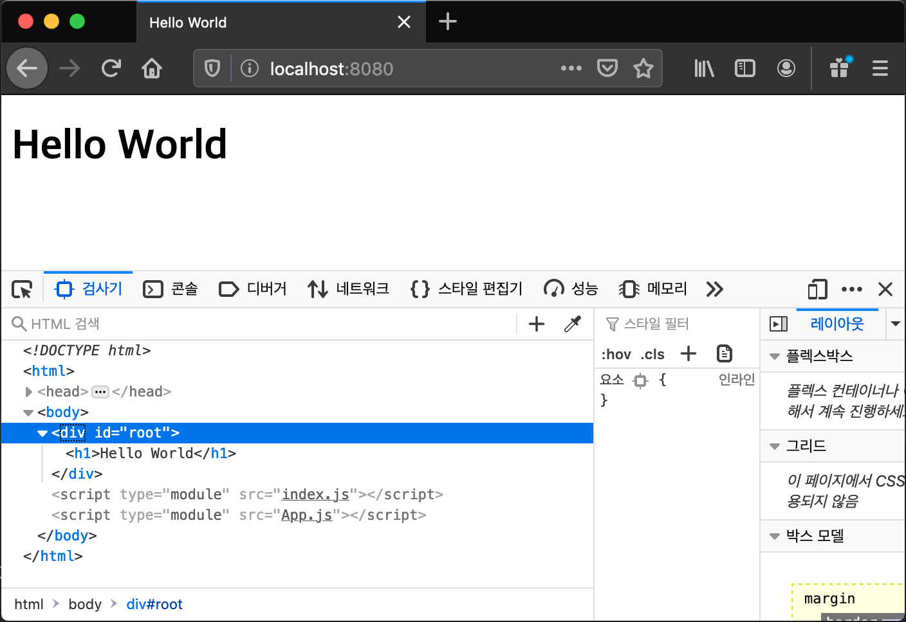

03

## 03. ES6 모듈 기반 애플리케이션

​	 모듈은 다른 JavaScript 파일에서 쉽게 불러 쓸 수 있는 재사용 가능한 코드(함수, 클래스, 객체, 상수, 변수 등)들을 가리킨다. JavaScript가 브라우저 밖으로 나와 범용 애플리케이션 작성이 가능하기 위해서는 코드를 분리하여 관리하고 재사용할 수 있는 모듈 시스템을 언어가 지원해야 했다. ES6 이전에는 외부 라이브러리(CommonJS 또는 AMD)의 모듈 지원을 활용 했었지만 ES6 부터는 자체 모듈 지원 표준이 마련되었다.

​	Node는 v14+ 부터 CommonJS 모듈 지원에서 ES6 표준 모듈 지원으로 교체했다. 이미 ch01-01에서 server.js 코드를 작성하면서 확인했지만 서버 사이드 뿐만 아니라 ES6 표준 모듈을 지원 브라우저가 점점 늘어나 대부분 브라우저가 지원하고 있는 상황이다. 따라서 복잡한 프론트엔드 애플리케이션도 ES6 표준 모듈 시스템 지원에 따라 분리 개발이 원칙적으로 가능하다.

​	계속 언급하고 있지만 Node V14+ 에서 ES6 모듈 지원 코드가 작동하기 위해서는 package.json의 type 엔트리를 'module' 로 설정해야 한다. 그리고 Node 기반 애플리케이션은 `npm init` 명령을 통해 프로젝트 매니페스트 파일 package.json 파일을 생성해야 한다. 브라우저 모듈 지원을 살펴 보기 전에 ES6 모듈을 간단히 알아보기 위해 Node에서 간단한 실습을 한다.  

#### 1. JavaScript 모듈 지원: project-ex01

##### 1-1. src/App.js module

```javascript
export const App = function(){
    const app = {};
    app.textContent = 'Hello World';

    return app;
};
```

​	ES6 모듈 지원에서는 각각의 모듈을 js 파일 단위로 저장한다. 쉽게 말해, js파일 하나가 모듈이라 보면 된다. 모듈 내부의 함수, 클래스, 객체, 상수, 변수 등은 export 키워드를 통해 외부에 노출하는데, 노출 방법은 여러 객체를 노출하거나 하나의 객체를 노출하는 두 가지 방법으로 나눌 수 있다. 예제는 함수 하나만 export 하고 있지만 여러 객체를 노출하는 방법을 사용하고 있다. 

​	앞에서 웹 애플리케이션 분리로 App.js와 index.js 두 모듈을 작성했다. 이 예제는 ES6 모듈을 테스트 하는 Node 기반 애플리케이션으로 브라우저에서 동작하는 애플리케이션이 아니다. 그래서 DOM API를 사용하여 HTMLElement 객체를 생성하는 대신 Object 타입 객체 `{}` 생성으로 바꿨다.     

##### 1-2. src/index.js module

```javascript
import  { App } from './App.js';

console.log(App());
```

​	index.js 에서 외부 모듈 App.js 모듈이 노출한 객체를 참조하기(불러오기) 위해 import 키워드를 사용했다. App.js 모듈이 다수의 객체를 하나의 객체에 담아 노출하는 export 방식이기 때문에 import 에서는 `ES6 객체 분해` 문법을 사용해서 하나의 객체 안에 노출된 여러 객체 중 불러올 특정 객체들을  `{}` 안에 지정한다. App.js 에서 노출된 객체는 App 함수밖에 없기 때문에 예제 index.js의 import 구문에서는 `{}` 안에 App 함수만 지정했다.

##### 1-3. 실행 및 결과 확인

```bash
$ node src/index
{ textContent: 'Hello World' }
```

​	Node 백엔드 애플리케이션을 여러 모듈로 나누고 모듈에서 객체를 export하고 import하는 방법을 ES6 모듈 지원 방법으로 실습해 보았다. 이 예제는 동일한 호스트의 지정된 위치에 이미 해당 모듈이 존재하는 상태에서 동작하기 때문에 ES6 모듈을 작성하는 방법과 사용법만 살펴본 예제다.

​	하지만 백엔드가 아닌 프론트엔드 애플리케이션 모듈에서는 네트워크를 통한 개별 모듈들의 로딩 동기화를 고려해야 한다. ES6 모듈을 지원하는 브라우저는 모듈 로딩 동기화를 해결하고 보장해 주기때문에 신경 쓰지 않고 어떻게 애플리케이션을 모듈로 잘 분리하고 재사용 문제 즉, 설계 문제만 고민하면 된다. 예제 project-ex02에서 확인해 보자.         

#### 2. 브라우저 모듈 지원: project-ex02

##### 2.1 public/index.html

```html
<!DOCTYPE html>
<head>
<meta charset='utf-8'>
<title>Hello World</title>
</head>
<body>
    <div id='root'></div>
    <script type="module" src='index.js'></script>
    <script type="module" src='App.js'></script>
</body>
```

​	앞의 실습과 동일하게 index.js, App.js 두 js 파일(모듈)를 링크한다. 다른 것은 `type='module'` ES6 모듈 지원 설정이다. 백엔드 작성에서 package.json 설정의 `'type': 'moduel'` 과 유사하다. 브라우저가 모듈 의존성과 로딩 동기화를 테스트하기 위해 일부러 index.js 먼저 로딩하게 순서를 설정했다. 의존성을 무시한 단순한 JavaScript 파일 로딩이면 에러가 발생할 것이다.

##### 2.2 public/index.js

```JavaScript
import { App } from './App.js'
document
    .getElementById('root')
    .appendChild(App());
```

​	import 구문을 사용해서 App.js 모듈의 App 함수를 import 한다.

##### 2.3 public/App.js

```JavaScript
export const App = function(){
    const app = document.createElement('h1');
    app.textContent = 'Hello World';

    return app;
}
```

​	export 구문을 사용해서 App 함수를 외부로 노출한다.

##### 2.4 Express 서버 작성 및 실행

​	앞의 실습과 같다. 실습 프로젝트에서 복사하거나 앞의 실습의 'Express 서버 작성 및 실행' 부분을 참고하여 server.js 작성하고 실행하도록 한다.

```bash
$ node server
starts server on port 8080
```

​	브라우저로 접근해 보면 잘 작동하는 것을 확인할 수 있다.



#### 3. 결론

​	ES6 모듈 지원으로 백엔드 뿐만 아니라 프론트엔드 애플리케이션 개발에서도 모듈로 분리하여 개발이 가능하다는 것을 확인 하였다. 복잡한 프론트엔드 애플리케이션 개발도 원칙적으로 잘 정의된 모듈로 분리하여 개발이 가능하다.

​	하지만, 프론트엔드 애플리케이션이 수십에서 수백 개의 모듈로 분리될 경우, 브라우저에서 개별적으로 이 모듈들을 import하는 것은 상당히 비효율적이다. 뿐만 아니라 더 고려해 보아야 할 프로그래밍 모델 관점의 문제점도 있다. 프론트엔드 웹 애플리케이션은 JavaScript 이 외의 다양한 애셋(HTML, CSS, Image, Font)으로 구성되어 있기 때문에 JavaScript가 이 다양하고 많은 애셋들을 어떻게 다루어야 개발뿐만 아니라 실행시 로딩 동기화에 문제가 없는 가 하는 점이다. 

​	이 문제는 다양한 모든 애셋들을 JavaScript 모듈로 취급하는 추상화 작업과 하나의 js 파일(번들)로 묶어 브라우저에 전달하는 것으로 해결하고 있다. 하나로 묶은 번들의 사이즈가 커지는 것이 문제가 되지만 이는 코드 분할 및 지연로딩 방법으로 해결한다. 번들로 묶어 주는 도구로 grunt, gulp, webpack 등이 있고 특히, webpack은 모듈간의 의존성 분석을 통해 의존 관계의 모듈들만 하나의 번들로 만든다. 이런 특징으로 빌드 도구에서 큰 인기를 얻고 있다.  

​	webpack 모듈 의존성 기반 빌드(번들링)을 이용해 모듈로 잘 분리된 애플리케이션을 하나의 번들로 만들 수 있고 브라우저는 모듈 지원 여부와 상관 없이 이 번들만 다운로드 하면 된다. 최근 대규모 프론트엔드 애플리케이션 개발에는 webpack을 사용한 번들링이 필수처럼 되었다. 당연히 애플리케이션은 모듈로 잘 분리되어 개발되어 있어야 함을 전제로 한다. ES6 모듈 스펙을 이해하고 개발에 적용할 줄 알아야 하는 이유이다.

​	다음 실습에서는 webpack을 사용하여 모듈로 분리된 애플리케이션을 번들링하고 번들 파일을 브라우저에 전달해 애플리케이션을 실행해 볼 것이다.